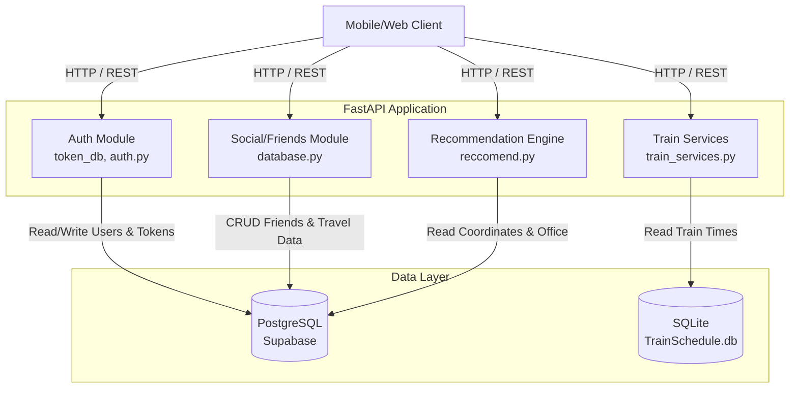
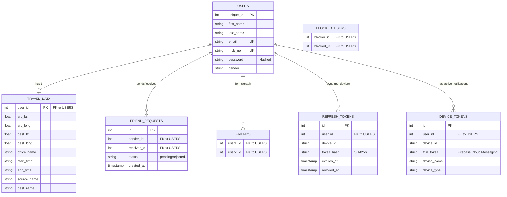
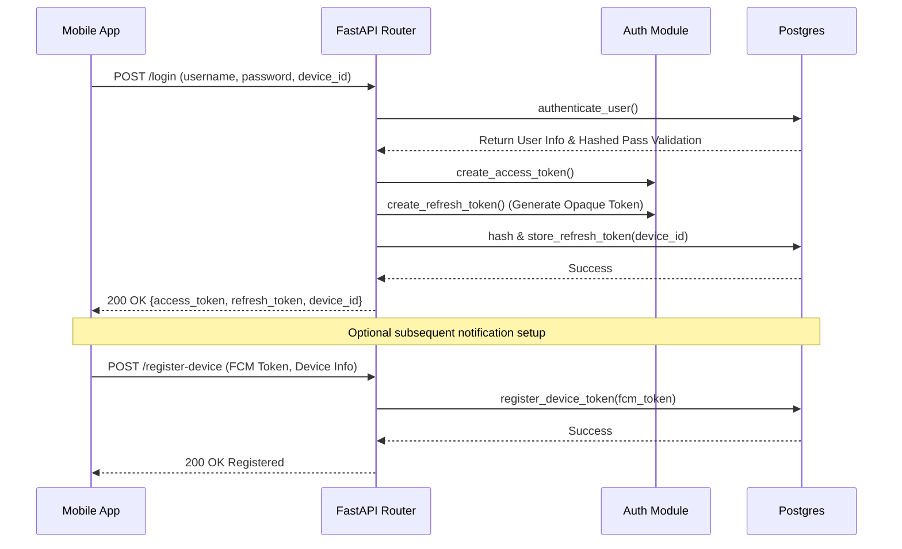
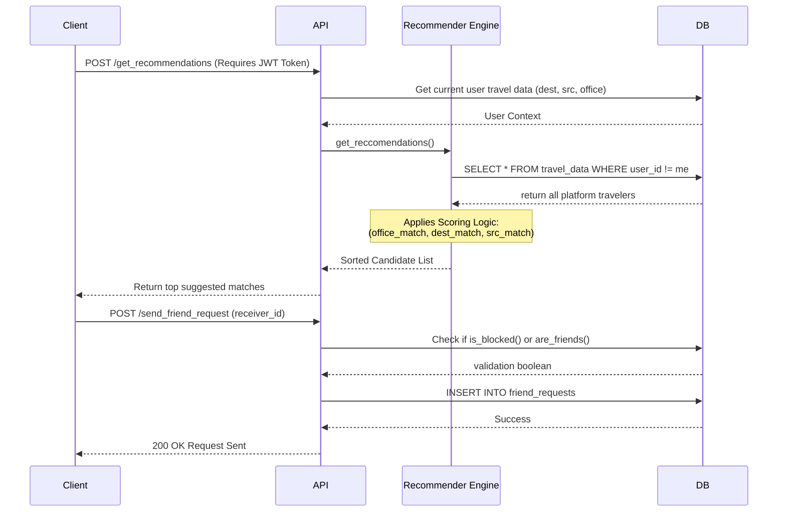

# 🚂 TrainMate Backend: System Architecture & Design

## 1. System Overview
**TrainMate** is a backend service designed to help daily commuters find travel buddies, manage social connections, and discover local train schedules. Built with a modern Python stack, it balances robust real-time API performance with secure authentication and spatial/commute-based recommendation logic.

### 1.1 Tech Stack
*   **Framework:** FastAPI (High-performance async Python web framework)
*   **Language:** Python 3.x
*   **Primary Database:** PostgreSQL (Hosted on Supabase) via `SQLAlchemy` (raw parameterized SQL execution rather than ORM models for fast execution).
*   **Secondary Database:** SQLite (`TrainSchedule.db`) for static, read-only train schedules.
*   **Authentication:** Custom JWT (JSON Web Tokens) for fast authorization, combined with opaque, hashed refresh tokens uniquely tied to user devices. 

---

## 2. Architecture Diagram

The system employs a standard client-server architecture. The FastAPI application acts as the central orchestrator, interfacing with dual database systems.

---

## 3. Database Design (Entity-Relationship)

The primary operational data is stored in the remote PostgreSQL instance. The schema is highly normalized and relies heavily on foreign key structures to handle friend graphs, tokens, and location data.

*Note: The SQLite database implicitly holds static data involving `[Train No.]`, `[Departure time]`, `[Arrival time]`, `[station Code]`, etc.*

---

## 4. Core Modules & Component Design

### 4.1. Authentication & Device Security (`auth.py`, `main.py`, Token DB functions)
The application utilizes a highly secure multi-device token architecture:
*   **JWT Access Tokens:** Short-lived tokens (e.g., 60 mins) used by client HTTP headers.
*   **Opaque Refresh Tokens:** Stored dynamically. Instead of storing direct plain-text JWTs in the DB, it generates an opaque UUID token, hashes it using `SHA256`, and stores the hash bound to strictly unique `device_id` strings. 
*   **Device Tracking & FCM:** Supports maintaining active logins across different devices seamlessly. Devices can register Firebase (`FCM`) tokens for future remote push notifications. Endpoint tools like `/logout` invalidate a single device token, while `/logout-all` invalidates everything linked to the `user_id`.

### 4.2. Recommendation Engine (`reccomend.py`)
Provides automated "travel buddy" suggestions.
*   The scoring algorithm constructs a tuple: `(office_match, dest_match, src_match, has_office)`.
*   Users are ranked continuously against the current user’s `travel_data`. 
*   A lexicographical sort ensures users going to the exact same office rank highest, followed by same destination, followed by same origin. 

### 4.3. Social Graph Logic (`database.py`)
Features a complete friend ecosystem preventing duplicates & errors through careful SQL transaction isolation:
*   **Friends & Filtering:** Endpoints control pending sent/received requests, acceptance, and rejecting. 
*   **Block Lists:** Before a friend request executes, the system validates the request against `blocked_users` guaranteeing privacy constraints are strictly adhered to.

### 4.4. Train Services Query (`train_services.py`)
Connects dynamically inside `get_trains_between_stations` to local `TrainSchedule.db`. Performs inner-joins natively filtering rows matching origin, destination `station Code`, and strictly limits outputs to trains leaving *after* the `current_time` variable.

---

## 5. Typical Workflows (Sequence Diagrams)

### 5.1. Authentication & Device Setup Flow

### 5.2. Recommendation & Social Flow

---

## 6. API Endpoints Overview

The following core REST endpoints are exposed by the FastAPI service:

### Auth & User Management
*   `GET /ping` - Health check endpoint.
*   `POST /login` - Login to receive JWT Access Token, Opaque Refresh Token, and Device ID.
*   `POST /register/` - Create a new user account.
*   `POST /token/refresh` - Swap a valid refresh token for a new set of access/refresh tokens.
*   `POST /logout` - Revoke the refresh token tied to the current device.
*   `POST /logout-all` - Revoke all active sessions (refresh tokens) for the user.
*   `POST /register-device` - Register a device FCM token for push notifications.

### User Travel & Recommendations
*   `POST /save_travel_data` - Save or update user source, destination, and office commute info.
*   `POST /get_recommendations` - Get sorted travel buddy suggestions based on the recommendation engine.
*   `GET /suggest_trains` - Fetch appropriate upcoming local trains based on source, destination, and current time.

### Social Graph (Friend Requests & Management)
*   `POST /send_friend_request` - Send a friend request to a platform user.
*   `POST /get_pending_requests` - View friend requests received from others.
*   `POST /get_pending_sent_requests` - View friend requests sent by the current user.
*   `POST /cancel_friend_request` - Unsend/cancel a pending friend request.
*   `POST /accept_friend_request` - Accept an incoming request.
*   `POST /reject_friend_request` - Decline an incoming request.
*   `POST /get_all_friends` - List all established friends.
*   `POST /remove_friend` - Unfriend a user.
*   `POST /block_user` - Block a specific user from interacting with you.

### Live Tracking
*   `POST /update_user_status` - Pings the DB to set current user status as "available" (at station).
*   `POST /get_friends_at_station` - Retrieves list of friends who are currently at the station.